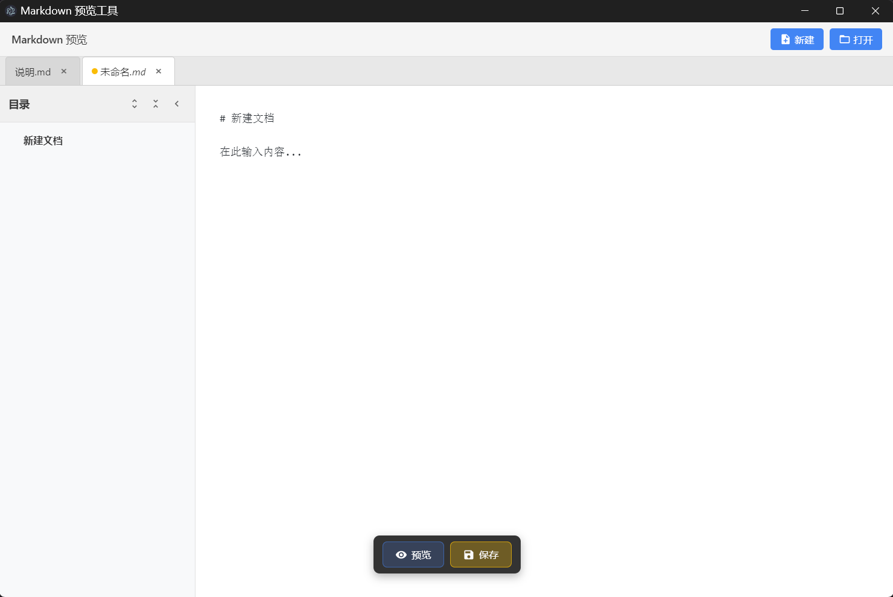
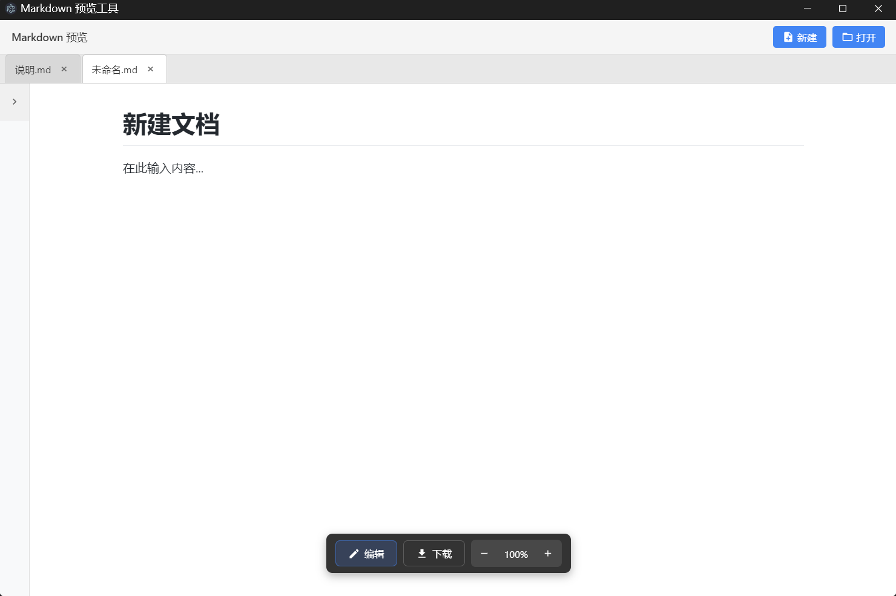

# Markdown 预览工具

基于 Electron + React + Vite 的 Markdown 预览和编辑桌面应用。

## 预览

| 编辑模式 | 预览模式 |
|---------|---------|
|  |  |

## 功能特性

### 文件操作
- **新建文件** - 点击工具栏"新建"按钮创建新的 Markdown 文件
- **打开文件** - 点击"打开"按钮或拖拽文件到窗口
- **保存文件** - 点击"保存"按钮或 Ctrl+S 快捷键
- **多标签支持** - 同时打开多个文件，支持拖拽排序
- **文件监视** - 外部修改文件时自动刷新

### 编辑功能
- **编辑/预览切换** - 点击底部浮动按钮或双击预览区域切换模式
- **未保存提示** - 切换到预览模式时，若有未保存更改会提示保存
- **Tab 缩进** - 编辑器支持 Tab 键插入缩进
- **未保存标记** - 标签页显示黄色圆点表示有未保存更改

### 预览功能
- **实时渲染** - 完整支持 Markdown 语法（标题、列表、表格、代码块等）
- **代码高亮** - 代码块语法高亮显示
- **目录导航** - 左侧目录树，点击快速跳转
- **缩放控制** - 25%-200% 缩放预览内容
- **导出 HTML** - 将 Markdown 导出为 HTML 文件

### 界面特性
- **简洁界面** - 无菜单栏，操作集中在工具栏和浮动按钮
- **侧边栏折叠** - 目录侧边栏可折叠隐藏
- **拖拽打开** - 支持拖拽 .md 文件到窗口打开

## 核心模块

### 主进程 (src/main/)

| 模块 | 功能 |
|------|------|
| index.ts | 应用入口，处理启动参数和文件关联 |
| WindowManager.ts | 窗口创建和安全配置 |
| FileHandler.ts | 文件对话框、读取和保存 |
| FileWatcher.ts | 多文件变化监视（chokidar） |
| IPCHandler.ts | 进程间通信 |

### 预加载脚本 (src/preload/)

| API | 功能 |
|-----|------|
| openFile() | 打开文件对话框 |
| readFile(path) | 读取文件内容 |
| saveFile(path, content) | 保存文件内容 |
| saveFileDialog(name) | 保存文件对话框 |
| closeFile(path) | 关闭文件监视 |
| onFileChanged(cb) | 监听文件变化 |
| onFileError(cb) | 监听错误 |

### 渲染进程 (src/renderer/)

| 模块 | 功能 |
|------|------|
| App.tsx | 多标签状态管理、文件操作 |
| TabBar.tsx | 标签栏（切换、关闭、拖拽排序、未保存标记） |
| Toolbar.tsx | 顶部工具栏（新建、打开） |
| EditorPane.tsx | Markdown 编辑器 |
| PreviewPane.tsx | Markdown 预览区域 |
| FloatingToolbar.tsx | 底部浮动工具栏（编辑/预览切换、保存、导出、缩放） |
| Sidebar.tsx | 目录导航侧边栏 |
| MarkdownRenderer.ts | Markdown 渲染（marked + highlight.js + DOMPurify） |
| ErrorToast.tsx | 错误提示 |

## 开发命令

```bash
# 开发模式
yarn dev

# 完整构建
yarn build

# 打包应用
yarn build:win     # Windows
yarn build:mac     # macOS
yarn build:linux   # Linux
```

## 构建产物

| 目录 | 内容 |
|------|------|
| dist/ | 渲染进程（HTML, CSS, JS） |
| dist-electron/ | 主进程（main.cjs, preload.cjs） |
| release/ | 打包的可执行文件 |

## 技术栈

- Electron 25 - 桌面应用框架
- React 18 - UI 框架
- TypeScript - 类型安全
- Vite - 构建工具
- marked - Markdown 解析
- highlight.js - 代码高亮
- DOMPurify - XSS 防护
- chokidar - 文件监视

## 开源协议

MIT License
